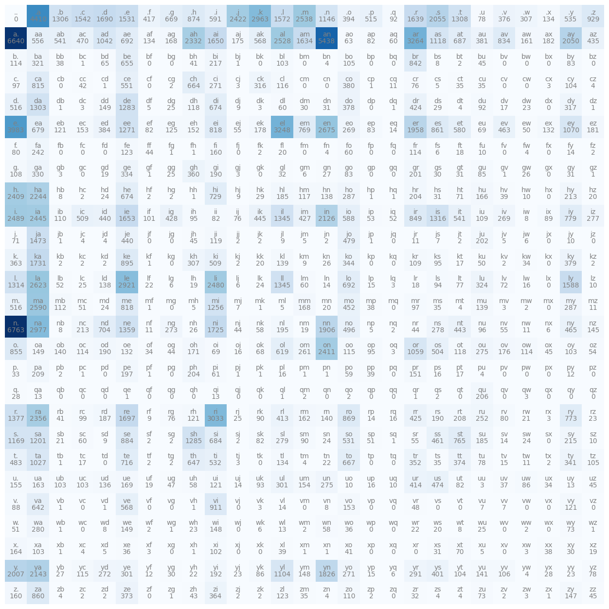
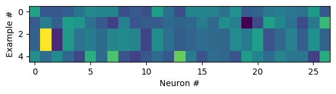
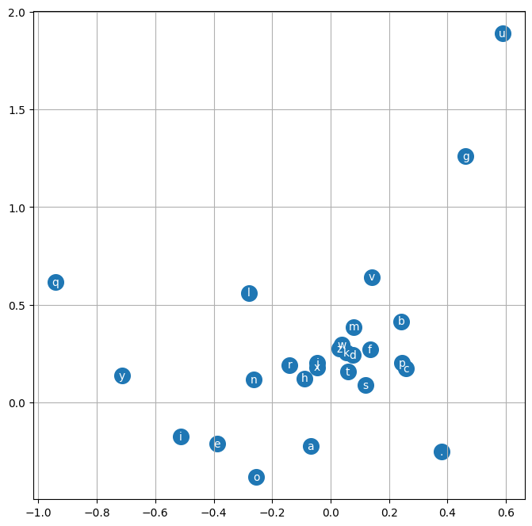
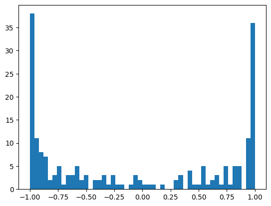
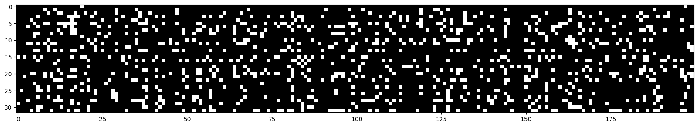
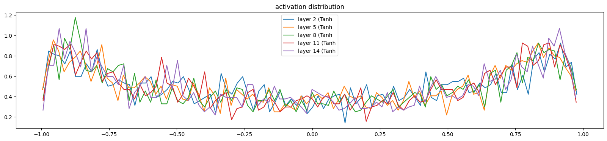

# Karpathy's Zero to Hero NN Series

Check out the notebooks and my code to see what I've actually written! Used numpy, pytorch (my tensors are flowing), jupyter, matplotlib. Here is [Karpathy's summary](https://karpathy.ai/zero-to-hero.html) of the lectures.

By the way, after some thinking, I consider the two most pivotal/important to understand moments in this whole thing about the entirety of ML would be:
- The backpropagation, via a local derivative and the next higher's gradient, and  how that cascades through a whole (differentiable) system so you.
- This little codeblock in 2 - makemore (unclean version) that explains W1, and that matrix multiplication bit (right underneath a pltshow).

The other lectures are important and very useful too, but these two are fundamental for understanding. The rest is "basically" optimisation (there's a *lot* in "basically").
## Snippets from my notebooks
That I found fun!
(like, the counts matrix, ..., the pltshow of my actual weights gradient -- shows what effect the weight has on the final loss! So crazy, and so cool.)
<!-- >> Do an open in collab for our 2 - makemore vid exercises?? I think that's a good representation of stuff we can do/we have been doing. -->

| Name | Jupyter File |  Colab Page
| ---  | --- | --- |
Makemore - Video 2 | [Click here](https://github.com/Antimatter543/karpathy-NN-lectures/blob/main/2%20-%20makemore/makemore.ipynb) | 
Exercises - Video 2 | [Click here](https://github.com/Antimatter543/karpathy-NN-lectures/blob/main/2%20-%20makemore/vid_exercises.ipynb) | 

###  Lecture 2 -- Makemore!
Implementing a proper language model -- just as classic bigram for now, and a vs a bigram NN.
Bigram count! 

Viewing the activation rates of neurons in a single layer for fun 

#### Lecture 3 
Visualising our character embeddings 

#### Lecture 4 -- Debugging NNs, batchnorm, ...
-  This lecture shows a lot of technical stuff about debugging neural network, checking its statistics and 'health'. Check out the [notebook](./4%20-%20makemore-pt3/makemore-batchnorm.ipynb)!
-  
- Tanh is saturated!!

Checking for dead neurons, and making sure there's no entire layers of dead neurons

Looking at our activation distribution after adding batchnorm (they are much more equal now -- good)

## Video summaries (by me)
<!-- Partially so I have an easier time putting these on my resume 😳 -->

### Video 1 - Micrograd
A bare implementation of neural networks. Created a Value wrapper class, implemented binary operations and backwards calls to allow a backwards call through mathematical expressions. Built neurons, layers, and MLP classes and forward passed data inputs with targets. Called backwards on the value, updated weights; achieving gradient descent and thus a neural net.

### Video 2 -- Makemore
A character level bigram model for name generation. Evaluated using negative log likelihood loss, then switched to constructing a neural network (in this case, effectively one layer of 27 neurons, each neuron having 27 weights). Converted characters to one hot encoded vectors, then converted logits to probability distributions by exponentiating and normalising (softmax). Optimised weights by minimising nll loss function during gradient descent stage. Created train, test, and dev sets for evaluation of models.    Implemented all ideas and steps by hand. Pytorch, jupyter, matplotlib.

### Video 3 - Makemore NLP 
Like makemore, but we went into depth about creating multiple layers and generalising to a *context size* -- how many characters we use to predict the next one. Also embedded characters, and focused on finetuning hyperparameters like learning rate, embedding size, number of layers, ... Effectively recreated the model from the [Bengio et al. 2003 MLP language model paper](https://www.jmlr.org/papers/volume3/bengio03a/bengio03a.pdf). Worked on many basics of ML: model training, learning rate tuning, hyperparameters, evaluation, train/dev/test splits, under/overfitting, etc.).

### Video 4 - Makemore, BatchNorm
- Initialised the NN to have a much better initial loss (no hockey stick 'easy gains'!) (you should always have some rough idea of what initial loss should look like).

I've completed videos 5-7, but I'll write up their summaries later because... procrastination?

<!-- ### Colab notebooks
| Colab Page | Video
| --- | --- |
### Video 3 - Makemore NLP 
Like makemore, but we went into depth about creating multiple layers and generalising to a *context size* -- how many characters we use to predict the next one. Also embedded characters.
Effectively recreated the model from the [Bengio et al. 2003 MLP language model paper](https://www.jmlr.org/papers/volume3/bengio03a/bengio03a.pdf).
 stable_diffusion_webui_colab | Micrograd -->